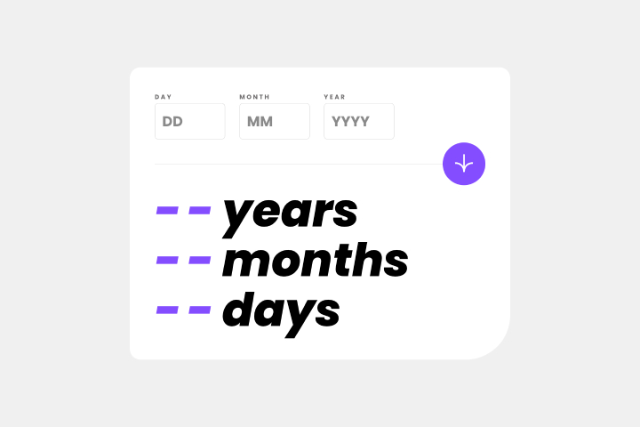

# Frontend Mentor - Age calculator app solution

This is Max Ruuen's solution to the [Age calculator app challenge on Frontend Mentor](https://www.frontendmentor.io/challenges/age-calculator-app-dF9DFFpj-Q). Frontend Mentor challenges help you improve your coding skills by building realistic projects.

## Table of contents

- [Overview](#overview)
  - [The challenge](#the-challenge)
  - [Screenshot](#screenshot)
  - [Links](#links)
- [My process](#my-process)
  - [Built with](#built-with)
  - [What I learned](#what-i-learned)
  - [Continued development](#continued-development)
- [Author](#author)

## Overview

### The challenge

Users should be able to:

- View an age in years, months, and days after submitting a valid date through the form
- Receive validation errors if:
  - Any field is empty when the form is submitted
  - The day number is not between 1-31
  - The month number is not between 1-12
  - The year is in the future
  - The date is invalid e.g. 31/04/1991 (there are 30 days in April)
- View the optimal layout for the interface depending on their device's screen size
- See hover and focus states for all interactive elements on the page
- **Bonus / To Be Completed**: See the age numbers animate to their final number when the form is submitted

### Screenshot

#### Desktop Layout

#### Mobile Layout

### Links

- Solution URL: [Frontend Mentor](https://www.frontendmentor.io/solutions/age-calculator-app-with-react-and-scss-0EEQWk_t45)
- Live Site URL: [Cloudflare Pages](https://mbr-challenge-age-calculator.pages.dev/)

## My process

### Built with

- React
- Luxon (JS date library)
- SCSS
- CSS Grid & Flex

### What I learned

This project was a lot of fun & I can't remember the last time I enjoyed the styling part of a project so much.

#### React Reducers

I learned a lot about React reducers during this project and this was my first implementation beyond a few example projects. It was originally written with state but I was able to refactor this into a reducer without too much drama, which has helped me to get a bit more confident with not overthinking the setup initially when I can refactor parts as needed.

I feel like the resulting code came out slightly cleaner than before, due to not needing to define my birthday state update logic in each place the update occurred, as well as storing part of the actual update logic in a separate file away from my main validation and component noise.

Will keep looking into reducers and finding the best ways to use them - I'm not sure mine was the most effective given it's a first go.

#### Date validation

To get easy date validation alongside a simple date diff function, I went with the Luxon library for datetime in JS. This was an easy library, but I found myself wondering if my implementation of the invalid date error handling was bad.

#### `Array.toSpliced()` browser support

I used this method in tons of places before realising that it's not supported in Firefox yet, and only got support in iOS Safari in iOS 16+.

Wasn't a massive deal to remove usage of this, but just a reminder that you should check early when thinking of using it for the first time.

### Continued development

I need to return and complete the bonus challenge item of animating the age result change. I've poked around at this but haven't delved into CSS animations on a good day, and would like to try not jumping straight to a React animations library first if possible.

## Author

- Frontend Mentor - [@ruuen](https://www.frontendmentor.io/profile/ruuen)
- Twitter - [@maxruuen](https://www.twitter.com/maxruuen)
